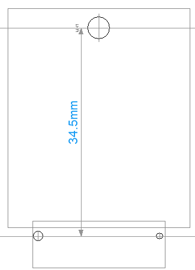
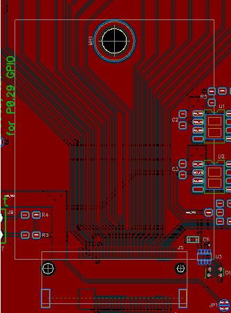

# LooUQ MTC2-N9151

The LooUQ MTC2-N9151 is our flagship modem based on the Nordic Semiconductor nRF9151 System-in-Package (SIP) device. Nordic's [documentation](https://docs.nordicsemi.com/category/nrf9151-category) about the nRF9151 SIP is relevant the our MTC2-N9151 modem. LooUQ has done the work to package the nRF9151 SIP into a convenient PCB form to make incorporation into your device as straight forward as possible.

The [MTC.2 Interface Guide](https://drive.google.com/file/d/1XxZAA_1KvOwKZDBlQWn0SYPFL24nAV9U/view?usp=drive_link) discusses the steps to incorporate the N9151 into your product/project. 
* The physical characteristics of mounting the N9151 in your host system
* The electrical requirements needed by the N9151
* The signals to/from the N9151 and it's host

*LooUQ software developement tooling is found in the [LQ-MTC2-SW](https://github.com/LooUQ/LooUQ-MTC2-SW) repository (also found on LooUQ's GitHub site). This includes resources for Nordic Connect SDK like board definition files and sample applications.*

# What You Need
To work with the MTC2-N9151 you will need some things at hand.
* Microsoft [Visual Studio Code](https://code.visualstudio.com/) code editor
* Nordic's [Nordic NRF Connect](https://www.nordicsemi.com/Products/Development-tools/nRF-Connect-for-Desktop?utm_feeditemid=&utm_device=c&utm_term=nrf54l15&utm_source=google&utm_medium=ppc&utm_campaign=nRF54L15&hsa_cam=21894111243&hsa_grp=177111642664&hsa_mt=b&hsa_src=g&hsa_ad=720961843386&hsa_acc=1116845495&hsa_net=adwords&hsa_kw=nrf54l15&hsa_tgt=kwd-2316120203756&hsa_ver=3&gad_source=1&gad_campaignid=21894111243&gbraid=0AAAAADPygHJwnoNPRfWQ0ravOUsDLXLXU&gclid=CjwKCAiA24XJBhBXEiwAXElO39W5oalXI05StjYgUkkjHeaIkVXiZc4hHY8_mm-0arYAEs6eRHNuhhoClUkQAvD_BwE) extension for VS Code
* Nordic's [nRF Connect for Desktop](https://www.nordicsemi.com/Products/Development-tools/nRF-Connect-for-Desktop?utm_feeditemid=&utm_device=c&utm_term=nrf54l15&utm_source=google&utm_medium=ppc&utm_campaign=nRF54L15&hsa_cam=21894111243&hsa_grp=177111642664&hsa_mt=b&hsa_src=g&hsa_ad=720961843386&hsa_acc=1116845495&hsa_net=adwords&hsa_kw=nrf54l15&hsa_tgt=kwd-2316120203756&hsa_ver=3&gad_source=1&gad_campaignid=21894111243&gbraid=0AAAAADPygHJwnoNPRfWQ0ravOUsDLXLXU&gclid=CjwKCAiA24XJBhBXEiwAXElO39W5oalXI05StjYgUkkjHeaIkVXiZc4hHY8_mm-0arYAEs6eRHNuhhoClUkQAvD_BwE) (optional, but highly recommended)
* A SWD debugging probe (Segger J-Link recommended)
* A MTC.2 host providing connections and power (see LooUQ's offerings below, available in our online store)
* A MTC2-N9151 *(of course you will need one or more of these)*
* Antenna(s) 
    * Depending on your use case you will need a cellular antenna for LTE/DECT-NR+ and a GNSS antenna for GNSS/GPS location determination.

## Using LooUQ Development hosts
LooUQ has two development hosts available to make getting started with the MTC2-N9151 a straight forward process: the MTC2-N9151-BRK (breakout board) and the MTC2-N9151-UXP (UXplor host). With either of these two boards, you can get started developing applications for the N9151. They are physically the same size and have identical peripheral header pin configurations.

### MTC2-N9151-Breakout
The N9151 breakout board is simply that, a breakout, exposing all the signals to/from the MTC2-N9151 modem device. Connections for external power, nRF9151 reset, SWD (flash/debug) and all peripheral pins (GPIO, I2C, SPI, UART, etc.). The breakout is designed to be simple and stay out of the way, providing only the essentials for flashing and debugging your N9151 applications.

### MTC2-N9151-UXplor
The N9151 UXplor is the breakout PLUS handy other functionality. The UXplor has a USB connector that sources power via integrated regulators. There is a VDD regulator delivery 3.8v and a VIO regulator that can be set for 3.3v or 1.8v. There is also a RGB LED indicator, the RBG controller is from TI and is I2C-connected. LooUQ provides a driver for LED controller, which is available in the LooUQ-MTC2-SW software repository.

## Creating MTC2-N9151 Applications
If you are new to ***Nordic nRF Connect*** consider investing time in completing one or more of the fine online courses at the [Nordic Developer Academy](https://academy.nordicsemi.com/). If you already have nRF Connect development experience, head over to the [software repository](https://github.com/LooUQ/LooUQ-MTC2-SW) and check out the information there. We have board definitions, samples, and driver code ready for your use. 

## Creating Your Own MTC2-N9151 Host 
LooUQ uses DipTrace as our PCB design suite. It has a complete set of tools for schematic creation, PCB layout, and maintaining component libraries. For information about DipTrace and how to use it see...[Get Diptrace](https://diptrace.com/). LooUQ has been using DipTrace as our electronics design tool since 2016 and we are proud to proclaim it's virtues: reasonable cost, wide support, comprehensive set of tooling; give it a try.

Given that there are multiple tools out there for PCB design/develoment, LooUQ is sharing our open-hardware designs in both DipTrace and Eagle formats. Eagle is a widely supported format for schematic and PCB board layouts. Both of the host boards above are available in the Boards folder of this repository. Depending on your needs either could be a good starting point for integration into your project.

Nordic documentation about the nRF9151 SIP applies to the LooUQ MTC2-9151; all limits should be observed. The MTC2-N9151 will draw slightly more power depending on operating state. GNSS has power draw for either the on-board LNA chip and optionally the external LNA power injection circuit. The N9151 also has 2 LEDs (power-green, network-blue), which can be individually disabled by cutting a jumper. LooUQ can deliver the MTC2-N9151 with custom LNA or LED configurations (note MOQ is required).

### Interfacing to the N9151
* Physical layout
* Power
    * VDD: 3.0v - 5.5v (LooUQ has observed that when VDD is above 4.5v, a VIO of 1.8v has issues)
    * VIO: 1.7v to 3.6v
    * The UXplor VDD is 3.8v and VIO is selectable at 3.3v or 1.8v
* Flash/debug requires connectivity to the 2 SWD pins (both the Breakout and UXplor expose these signals to a 10-pin Cortex header)
* Both LTE/DECT and GNSS antennas are directly connected to the MTC2-N9151 via U.FL connectors

**Host Physical Board Layout**
The physical connection between the MTC2-N9151 and the host PCB is accomplished with 3 parts in the configuration below.
* TE 1-2199230-6 (M.2 Key-M)
* Wurth 9774025151R (M2.5 stand-off, soldered)
* 2.5M x 8mm hex head bolt (fully-threaded, course)

  

